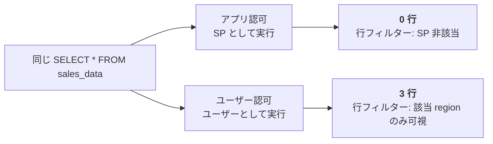
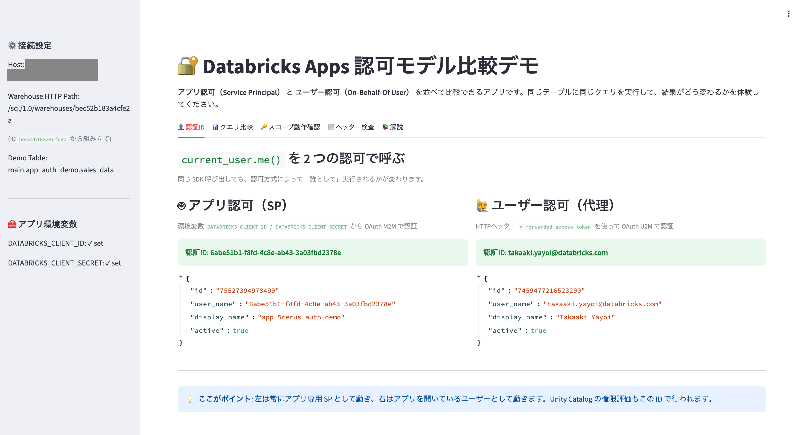
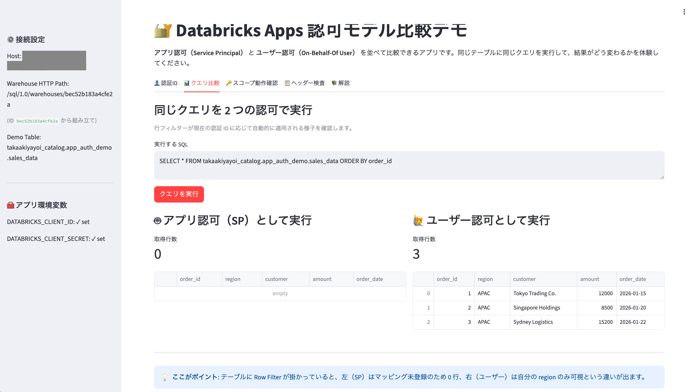

# Databricks Apps 認可モデル比較デモ

アプリ認可 ( Service Principal ) とユーザー認可 ( On-Behalf-Of User ) の振る舞いの違いを、同じ画面・同じクエリで並べて確認できる Streamlit アプリです。Databricks Apps の認可まわりが「結局何が違うのか」をひと目で理解するためのハンズオン教材として作りました。

詳細解説の記事は Qiita で公開しています ( URL は記事公開時に追記 )。

## デモが見せるもの



同じ SDK 呼び出し、同じ SQL、同じテーブルなのに、認可方式によって Unity Catalog の評価結果が変わる、というのが目で見える構図です。

## 機能

5 つのタブで Databricks Apps の認可モデルを多角的に確認できます。

| タブ | 何が見える |
|---|---|
| 👤 認証ID | 同じ `current_user.me()` が SP の UUID とユーザーのメールアドレスを返す違い |
| 📊 クエリ比較 | 同じ `SELECT` が 0 行と 3 行に分かれる ( 行フィルター効果 ) |
| 🔑 スコープ動作確認 | `app.yaml` で宣言したスコープ外の API がブロックされる挙動 |
| 📋 ヘッダー検査 | `x-forwarded-access-token` などの転送ヘッダーの中身 |
| 📚 解説 | 認可モデルの早見表 |

## スクリーンショット

<!-- TODO: スクショを images/ に置いて差し替え -->



> 左ペインは SP の UUID、右ペインはユーザーのメールアドレス。同じ `current_user.me()` の結果。



> 左 0 行・右 3 行。Unity Catalog の行フィルターが認証 ID に応じて評価される瞬間。

## 前提環境

| 項目 | 要件 |
|---|---|
| Databricks ワークスペース | Unity Catalog 有効化済み |
| Databricks Apps | 利用可能 ( ワークスペース管理者が有効化済み ) |
| ユーザー認可機能 | パブリックプレビュー機能の有効化が必要 |
| SQL Warehouse | Serverless または Pro で稼働中 |
| Unity Catalog 権限 | 任意のカタログへの `CREATE SCHEMA` 等 |
| 開発環境 | Databricks CLI v0.230 以降 |

## クイックスタート

### 1. Unity Catalog をセットアップ

`setup/01_setup_unity_catalog.sql` をエディタで開き、`your.email@example.com` を**自分のメールアドレス**に置換してから SQL Editor で実行します。`main` カタログ以外を使う場合は、ファイル内の `main` も置換してください。

### 2. アプリを作成

ワークスペースの「Compute」→「Apps」から新規アプリを作成します。作成直後の「Authorization」タブで**アプリ専用 SP の Application ID** をコピーしておきます。

### 3. SQL Warehouse をリソースとして紐付ける

アプリの「App resources」で:

- Resource type: **SQL warehouse**
- **Resource key: `sql_warehouse`** ( `app.yaml` の `valueFrom` と一致が必須 )
- Permission: **CAN_USE**

### 4. コードをデプロイ

```bash
git clone https://github.com/<your-org>/databricks-apps-user-auth-demo.git
cd databricks-apps-user-auth-demo

databricks sync . /Workspace/Users/<your-email>/apps/auth-demo
databricks apps deploy auth-demo \
  --source-code-path /Workspace/Users/<your-email>/apps/auth-demo
```

### 5. SP に Unity Catalog 権限を付与

ステップ 2 でコピーした Application ID を使います。

```sql
GRANT USE CATALOG ON CATALOG main TO `<APP_SP_APPLICATION_ID>`;
GRANT USE SCHEMA  ON SCHEMA main.app_auth_demo TO `<APP_SP_APPLICATION_ID>`;
GRANT SELECT      ON TABLE main.app_auth_demo.sales_data TO `<APP_SP_APPLICATION_ID>`;
GRANT SELECT      ON TABLE main.app_auth_demo.user_region_map TO `<APP_SP_APPLICATION_ID>`;
```

### 6. ユーザー認可スコープを追加

アプリの「User authorization」→「+ Add scope」で `sql` を追加し、**アプリを再起動**します。

```bash
databricks apps stop auth-demo
databricks apps start auth-demo
```

### 7. 初回アクセスして同意

アプリ URL を開いて同意画面を完了させると、`x-forwarded-access-token` が転送されるようになります。

## ファイル構成

```
.
├── README.md                              # このファイル
├── LICENSE                                # MIT
├── app.py                                 # Streamlit アプリ ( 5 タブ )
├── app.yaml                               # Databricks Apps 設定
├── requirements.txt                       # Python 依存
├── setup/
│   └── 01_setup_unity_catalog.sql         # 行フィルター付きデモテーブル
└── images/                                # スクリーンショット
```

## ハマりやすいポイント ( 抜粋 )

| 症状 | 原因と対処 |
|---|---|
| `validate: more than one authorization method configured: oauth and pat` | `WorkspaceClient(token=...)` に `auth_type="pat"` を明示。SP の OAuth 環境変数が SDK に拾われるのを止める |
| `DATABRICKS_WAREHOUSE_HTTP_PATH` が `None` | Resource key が `sql_warehouse` でないか、追加後にアプリを再起動していない |
| クエリで `current_user()` が SP の UUID を返す | ユーザートークンを `sql.connect()` の `access_token=` に渡せていない |
| `x-forwarded-access-token` が `None` | スコープ未設定 / 再起動前 / ローカル開発 ( Apps 環境のみ転送される ) |

詳細な解説と全項目は [Qiita 記事](https://qiita.com/taka_yayoi/items/ad7330438c7d6f91d37f)を参照してください。

## 参考リンク

- [Databricks Apps で承認を構成する](https://learn.microsoft.com/ja-jp/azure/databricks/dev-tools/databricks-apps/auth)
- [Databricks Apps の HTTPヘッダー](https://learn.microsoft.com/ja-jp/azure/databricks/dev-tools/databricks-apps/http-headers)
- [Unity Catalog の行フィルター](https://learn.microsoft.com/ja-jp/azure/databricks/tables/row-and-column-filters)

## License

[MIT](LICENSE)
